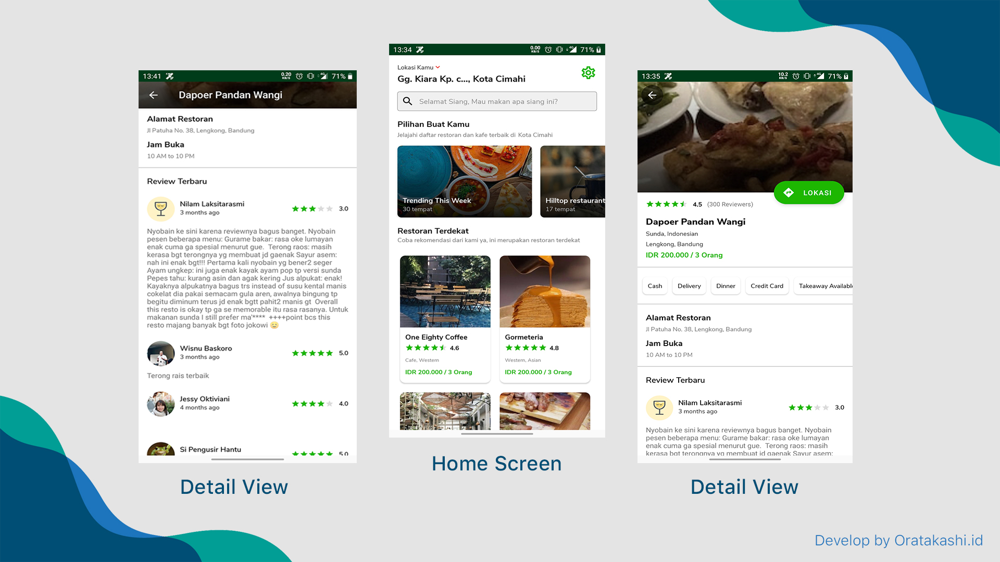

<p align="center">
  <a href="#">
		<h1 align="center">Resto Finder</h1>
  </a>
</p>
<p align="center">
  Restofinder adalah sebuah aplikasi sederhana yang menampilkan daftar restoran terdekat dari lokasi kita dengan beberapa spesifik jenis dan menu yang dihidangkan. Project ini menggunakan API Zoomato untuk mencari restoran, jadi kita harus membuat apikey Zoomato terlebih dahulu, Project ini free dan open source (Boleh di kembangkan lagi)
</p>
<span align="center">
 <hr>
 <p align="center"></p>
 <p align="center">Screenshot</p>
 <hr>
  <p align="center"></p>
 <p align="center">Screenshot</p>
 <hr>
 </span>
 <h1>Download Demo</h1>
 https://download.oratakashi.com/restofinder.apk
 <br>
 
 
 ### Apps Feature:

- Get Nearby Restaurant 
- Get Collections
- Get Restaurant By Collection
- Restaurant Details
- Search Restaurant
- Geocoding & GPS System
- Multi Language
- Dark Mode
- Navigate into Restaurant
 

  ### Setup
  1. Anda harus membuat API Key Zoomato pada situs <a href="https://developers.zomato.com/api?lang=id">Zoomato Developer</a>
  2. Masukkan Api Key yang sudah dibuat pada config seperti berikut:
	 **core/Config.kt**
```kotlin
object Config {
    const val Key = "{{ YOUR_API_KEY }}"
    const val DummyImage =
        "https://i.pinimg.com/originals/e2/62/6c/e2626c8f2581f6de2c9e325b67957a3b.jpg"
}
```
<br>
 <h1>Creator</h1>
 <p>RestoFinder is created by [Oratakashi](http://github.com/oratakashi)</p>
 <p>You can contact me at : oratakashi@oratakashi.com</p>
 <h1>License</h1>
 <p>RestoFinder Apps is under the [GPL3 License](LICENSE)</p>
